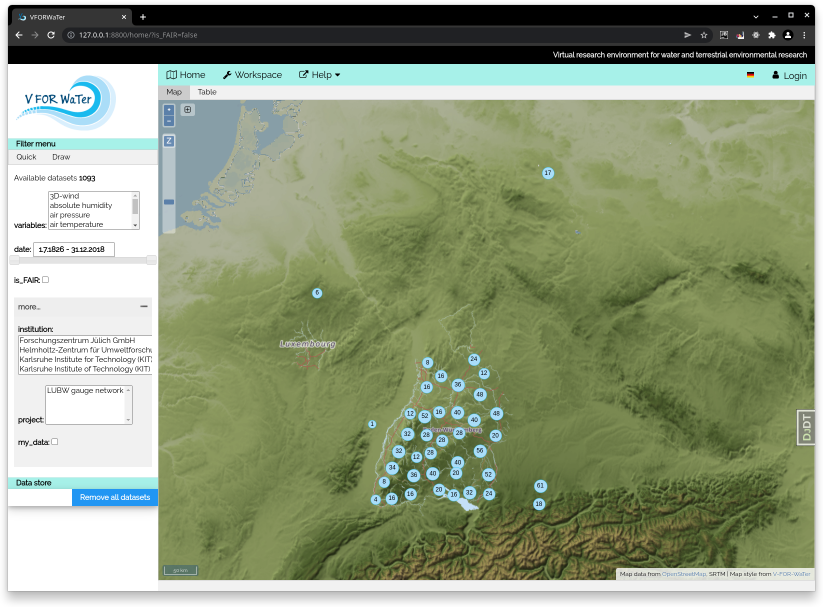

# V-FOR-WaTer portal

Vforwater-portal is an open source virtual research environment written in django for common and systematic management of data obtained from water and environmental research.

 

*Above: Screenshot of V-FOR-WaTer Home Screen.*

# Installation notes

For installation instructions please look at [`install_notes.txt`](install_notes.txt).
There are no special dependencies on the LINUX distribution. We tested the installation on Fedora 36, Centos 7, and RHEL 7.
Code is still under development and comes with no guarantees.

In the original project the database is managed by ['metacatalog'](https://github.com/VForWaTer/metacatalog), but just for
testing the project, you can set `managed = False` in all `models.py` before you run migrations.

# Dependencies

vforwater-portal is a Django project (we testet Django 5.2, python 3.9)

The following components are needed:
* PostGIS (we testet postgresql 9.6, 10.6, 11.2 + postgis 2.4, 2.5)
* Geoserver - to show data on the map (we testet 2.12.2 and 2.14.1, Oracle Java + tomcat or OpenJDK)

# License

vforwater-portal is licensed under the MIT license.
